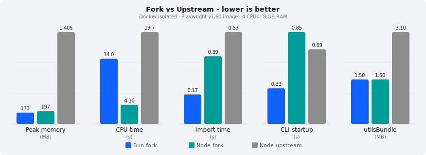

# 🎭 Playwright

[](https://www.npmjs.com/package/playwright) <!-- GEN:chromium-version-badge -->[](https://www.chromium.org/Home)<!-- GEN:stop --> <!-- GEN:firefox-version-badge -->[](https://www.mozilla.org/en-US/firefox/new/)<!-- GEN:stop --> <!-- GEN:webkit-version-badge -->[](https://webkit.org/)<!-- GEN:stop --> [](https://aka.ms/playwright/discord)

## [Documentation](https://playwright.dev) | [API reference](https://playwright.dev/docs/api/class-playwright)

Playwright is a framework for web automation and testing. It drives Chromium, Firefox, and WebKit with a single API: in your tests, in your scripts, and as a tool for AI agents.

## About This Fork

Tracks upstream microsoft/playwright. The fork adds Bun runtime support, native mobile testing, Storybook integration, Lighthouse audits, and performance optimizations while keeping full compatibility with upstream Playwright tests.

### Performance

All numbers below are from a Docker-isolated benchmark using the official Playwright v1.60.0 image, capped at 4 CPUs and 8 GB RAM.



| Metric | Bun fork | Node fork | Node upstream | Δ Node | Δ Bun |
|---|---|---|---|---|---|
| Peak memory | **173 MB** | **197 MB** | 1,405 MB | 86% less | 88% less |
| CPU time | 14.0 s | **4.1 s** | 19.7 s | 79% less | 29% less |
| Import time | **0.17 s** | **0.39 s** | 0.53 s | 26% faster | 68% faster |
| CLI startup | **0.33 s** | 0.85 s | 0.69 s | 23% slower | 52% faster |
| utilsBundle | **1.5 MB** | **1.5 MB** | 3.1 MB | 52% smaller | 52% smaller |

<sub>Docker: mcr.microsoft.com/playwright:v1.60.0 · match-grep.spec.ts · single worker · 4 CPUs · 8 GB · Node v24 / Bun 1.3</sub>

Key optimizations: utilsBundle split (3.1 → 1.5 MB), lazy playwright-core and yauzl imports, grep-based early file filtering, esbuild targeting node24, V8 structured-clone IPC, and tsconfig path fixes for Bun. Reproduce with `docker build -t pw-bench -f docs/Dockerfile.bench . && docker run --rm -v $(pwd):/bench/fork --cpus=4 --memory=8g pw-bench`.

### Bun runtime

Playwright runs under Bun as a first-class runtime alongside Node. Workers are native Bun processes, so Bun APIs are available directly in tests. Upstream microsoft/playwright does not support Bun.

**Run tests with Bun:**

```bash
bun playwright test
```

**Use Bun APIs in tests:**

```ts
import { test, expect } from '@playwright/test';

test('serve a fixture with Bun', async ({ page }) => {
  const server = Bun.serve({
    port: 0,
    fetch: () => new Response('<h1>Hello</h1>', {
      headers: { 'Content-Type': 'text/html' },
    }),
  });
  await page.goto(`http://localhost:${server.port}`);
  await expect(page.getByRole('heading')).toHaveText('Hello');
  server.stop();
});
```

### Mobile testing - Android

The @playwright/mobile package drives native apps through Appium 2 via the W3C WebDriver protocol. No selenium-webdriver or webdriverio dependency at runtime. See [packages/playwright-mobile/README.md](packages/playwright-mobile/README.md).

**Android test:**

```ts
import { mobileTest as test, expect } from '@playwright/experimental-mobile';

test.use({
  capabilities: {
    app: 'apks/dev.apk',
    appPackage: 'com.example.dev',
  },
});

test('login and check the dashboard', async ({ device }) => {
  await device.app.getByTestId('email').fill('user@example.com');
  await device.app.getByTestId('password').fill('s3cret');
  await device.app.getByTestId('signin').click();
  await device.waitForVisible(device.app.getByText('Dashboard'));
  await expect(device.app.getByText('Welcome back')).toBeVisible();
});
```

### Mobile testing - iOS

iOS uses the same `mobileTest` fixture. Pass a Playwright device descriptor for screenshot baseline metadata.

**iOS test:**

```ts
import { mobileTest as test, expect } from '@playwright/experimental-mobile';
import { devices } from '@playwright/test';

test.use({
  capabilities: {
    app: 'apps/MyApp.app',
    bundleId: 'com.example.myapp',
    deviceName: 'iPhone 15 Sim',
  },
  descriptor: devices['iPhone 15'],
});

test('search and screenshot', async ({ device }) => {
  await device.app.getByPlaceholder('Search').fill('playwright');
  await device.app.getByRole('button').first().tap();
  await expect(device.app.getByText('Results')).toBeVisible();
  await expect(device).toHaveScreenshot();
});
```

### Mobile testing - WebView hybrid apps

Switch between native and web contexts in the same test. The device detects available WebViews and lets you use Playwright-style locators inside them.

```ts
import { mobileTest as test, expect } from '@playwright/experimental-mobile';

test.use({
  capabilities: { appPackage: 'com.example.hybrid' },
});

test('native to webview round trip', async ({ device }) => {
  await device.app.getByTestId('open-webview').click();
  const wv = await device.waitForWebViewContext({ title: /Checkout/ });
  await device.switchToWebViewContext(wv);
  // Now inside the WebView; standard web locators work
  await device.switchToContext(undefined); // back to native
  await expect(device.app.getByText('Order confirmed')).toBeVisible();
});
```

### Storybook integration

The @playwright/storybook package auto-discovers stories from a running Storybook instance and generates Playwright tests. See [packages/playwright-storybook/README.md](packages/playwright-storybook/README.md).

**Discover and test all stories:**

```ts
import { storybookTest as test, expect, fetchStoryIndex, filterStories } from '@playwright/storybook';

const index = await fetchStoryIndex('http://localhost:6006');
const stories = filterStories(index, { include: ['Button/*'] });

for (const story of stories) {
  test(`renders ${story.title} / ${story.name}`, async ({ mountStory, page }) => {
    await mountStory(story.id);
    await expect(page.locator('#storybook-root, #root')).toBeVisible();
    await expect(page).toHaveScreenshot(`${story.id}.png`);
  });
}
```

**Replay a Storybook play function:**

```ts
import { storybookTest as test, expect, runPlayFunction } from '@playwright/storybook';

test('Login form play function', async ({ page, mountStory }) => {
  await mountStory('form-login--default');
  await runPlayFunction(page, 'form-login--default');
  await expect(page.getByText('Welcome')).toBeVisible();
});
```

**Config** - point Playwright at your Storybook dev server:

```ts
// playwright.config.ts
import { defineConfig } from '@playwright/test';

export default defineConfig({
  use: { baseURL: 'http://localhost:6006' },
  webServer: {
    command: 'npm run storybook -- --ci',
    url: 'http://localhost:6006',
    reuseExistingServer: true,
  },
});
```

### Lighthouse audits

The @playwright/lighthouse package runs Lighthouse against the same Chromium tab the test is driving. The remote debugging port is wired automatically by the fixture. See [packages/playwright-lighthouse/README.md](packages/playwright-lighthouse/README.md).

**Performance and accessibility audit:**

```ts
import { lighthouseTest as test, expect } from '@playwright/lighthouse';

test('homepage meets perf budget', async ({ page, lighthouse }) => {
  await page.goto('https://example.com');
  const result = await lighthouse({
    thresholds: { performance: 90, accessibility: 95, seo: 80 },
    saveReport: 'html',
  });
  expect(result.passed, result.failures.join('\n')).toBe(true);
});
```

**Compose Storybook + Lighthouse** for per-story perf budgets:

```ts
import { storybookTest } from '@playwright/storybook';
import { lighthouseTest } from '@playwright/lighthouse';

const test = storybookTest.extend(lighthouseTest.fixtures);

test('Button/Primary perf budget', async ({ page, mountStory, lighthouse }) => {
  await mountStory('button--primary');
  const result = await lighthouse({ thresholds: { performance: 90 } });
  expect(result.passed).toBe(true);
});
```

### Additional features

**Cloud device farms.** Connect to a remote Appium device farm via WebSocket with token auth:

```ts
const device = await playwright.appium.connectToCloud(
  'wss://mobile.playwright.dev',
  { appPackage: 'com.example' },
  { token: process.env.PLAYWRIGHT_MOBILE_TOKEN, timeout: 60_000 }
);
```

**Locators.** getById and getByClassName on Page, Locator, Frame, and FrameLocator. Substring match by default, exact match with the exact option.

```ts
await page.getById('submit-btn').click();
await page.getByClassName('featured').click();
```

**Reporters.** Added built-in shorthands: catalog, ai, csv, jira, new-relic, xray.

**Matchers.** Added toBeWithinRange, toHaveResponseProperty, toMatchJsonSchema.

**Upstream sync.** utils/sync_upstream.sh (dry-run merge) and utils/analyze_upstream.sh (conflict prediction) for safe upstream pulls. Patches not merged upstream are carried locally, e.g. shardingMode [#30962](https://github.com/microsoft/playwright/pull/30962).

| Surface | Fork | Upstream | What the fork adds |
|---|---|---|---|
| Runtime targets | **3** | 1 | Bun runtime, native mobile via Appium 2 |
| Built-in reporters | **15** | 9 | catalog, ai, csv, jira, xray, newRelic |
| Custom matchers | **41** | 38 | toBeWithinRange, toHaveResponseProperty, toMatchJsonSchema |
| Workspace packages | **24** | 21 | @playwright/mobile, @playwright/storybook, @playwright/lighthouse |
| Locator helpers | **9** | 7 | getById, getByClassName |
| Mobile locators | **15** | 0 | Full AppLocator API parity |


## Get Started

Choose the path that fits your workflow:

|                                               | Best for                                | Install                                                                                                  |
|-----------------------------------------------|-----------------------------------------|----------------------------------------------------------------------------------------------------------|
| **[Playwright Test](#playwright-test)**       | End-to-end testing                      | `npm init playwright@latest`                                                                             |
| **[Playwright CLI](#playwright-cli)**         | Coding agents (Claude Code, Copilot)    | `npm i -g @playwright/cli@latest`                                                                        |
| **[Playwright MCP](#playwright-mcp)**         | AI agents and LLM-driven automation     | `npx @playwright/mcp@latest`                                                                             |
| **[Playwright Library](#playwright-library)** | Browser automation scripts              | `npm i playwright`                                                                                       |
| **[VS Code Extension](#vs-code-extension)**   | Test authoring and debugging in VS Code | [Install from Marketplace](https://marketplace.visualstudio.com/items?itemName=ms-playwright.playwright) |

---

## Playwright Test

Playwright Test is a full-featured test runner built for end-to-end testing. It runs tests across Chromium, Firefox, and WebKit with full browser isolation, auto-waiting, and web-first assertions.

### Install

```bash
npm init playwright@latest
```

Or add manually:

```bash
npm i -D @playwright/test
npx playwright install
```

### Write a test

```TypeScript
import { test, expect } from '@playwright/test';

test('has title', async ({ page }) => {
  await page.goto('https://playwright.dev/');
  await expect(page).toHaveTitle(/Playwright/);
});

test('get started link', async ({ page }) => {
  await page.goto('https://playwright.dev/');
  await page.getByRole('link', { name: 'Get started' }).click();
  await expect(page.getByRole('heading', { name: 'Installation' })).toBeVisible();
});
```

### Run tests

```bash
npx playwright test
```

Tests run in parallel across all configured browsers, in headless mode by default. Each test gets a fresh browser context with full isolation and near-zero overhead.

### Key capabilities

**Auto-wait and web-first assertions.** No artificial timeouts. Playwright waits for elements to be actionable, and assertions automatically retry until conditions are met.

**Locators.** Find elements with resilient locators that mirror how users see the page:

```TypeScript
page.getByRole('button', { name: 'Submit' })
page.getByLabel('Email')
page.getByPlaceholder('Search...')
page.getByTestId('login-form')
```

**Test isolation.** Each test runs in its own browser context, equivalent to a fresh browser profile. Save authentication state once and reuse it across tests:

```TypeScript
// Save state after login
await page.context().storageState({ path: 'auth.json' });

// Reuse in other tests
test.use({ storageState: 'auth.json' });
```

**Tracing.** Capture execution traces, screenshots, and videos on failure. Inspect every action, DOM snapshot, network request, and console message in the [Trace Viewer](https://playwright.dev/docs/trace-viewer):

```TypeScript
// playwright.config.ts
export default defineConfig({
  use: {
    trace: 'on-first-retry',
  },
});
```

```bash
npx playwright show-trace trace.zip
```

<!-- TODO: screenshot of trace viewer -->

**Parallelism.** Tests run in parallel by default across all configured browsers.

[Full testing documentation](https://playwright.dev/docs/intro)

---

## Playwright CLI

[Playwright CLI](https://github.com/microsoft/playwright-cli) is a command-line interface for browser automation designed for coding agents. It's more token-efficient than MCP; commands avoid loading large tool schemas and accessibility trees into the model context.

### Install

```bash
npm install -g @playwright/cli@latest
```

Optionally install skills for richer agent integration:

```bash
playwright-cli install --skills
```

### Usage

Point your coding agent at a task:

```
Test the "add todo" flow on https://demo.playwright.dev/todomvc using playwright-cli.
Take screenshots for all successful and failing scenarios.
```

Or run commands directly:

```bash
playwright-cli open https://demo.playwright.dev/todomvc/ --headed
playwright-cli type "Buy groceries"
playwright-cli press Enter
playwright-cli screenshot
```

### Session monitoring

Use `playwright-cli show` to open a visual dashboard with live screencast previews of all running browser sessions. Click any session to zoom in and take remote control.

```bash
playwright-cli show
```

<!-- TODO: screenshot of playwright-cli show dashboard -->

[Full CLI documentation](https://playwright.dev/agent-cli/introduction) | [GitHub](https://github.com/microsoft/playwright-cli)

---

## Playwright MCP

The [Playwright MCP server](https://github.com/microsoft/playwright-mcp) gives AI agents full browser control through the [Model Context Protocol](https://modelcontextprotocol.io). Agents interact with pages using structured accessibility snapshots, with no vision models or screenshots required.

### Setup

Add to your MCP client (VS Code, Cursor, Claude Desktop, Windsurf, etc.):

```json
{
  "mcpServers": {
    "playwright": {
      "command": "npx",
      "args": ["@playwright/mcp@latest"]
    }
  }
}
```

**One-click install for VS Code:**

[](https://insiders.vscode.dev/redirect?url=vscode%3Amcp%2Finstall%3F%257B%2522name%2522%253A%2522playwright%2522%252C%2522command%2522%253A%2522npx%2522%252C%2522args%2522%253A%255B%2522%2540playwright%252Fmcp%2540latest%2522%255D%257D)

**For Claude Code:**

```bash
claude mcp add playwright npx @playwright/mcp@latest
```

### How it works

Ask your AI assistant to interact with any web page:

```
Navigate to https://demo.playwright.dev/todomvc and add a few todo items.
```

The agent sees the page as a structured accessibility tree:

```
- heading "todos" [level=1]
- textbox "What needs to be done?" [ref=e5]
- listitem:
  - checkbox "Toggle Todo" [ref=e10]
  - text: "Buy groceries"
```

It uses element refs like `e5` and `e10` to click, type, and interact deterministically, without visual ambiguity. Tools cover navigation, form filling, screenshots, network mocking, storage management, and more.

[Full MCP documentation](https://playwright.dev/mcp/introduction) | [GitHub](https://github.com/microsoft/playwright-mcp)

---

## Playwright Library

Use `playwright` as a library for browser automation scripts: web scraping, PDF generation, screenshot capture, and any workflow that needs programmatic browser control without a test runner.

### Install

```bash
npm i playwright
```

### Examples

**Take a screenshot:**

```TypeScript
import { chromium } from 'playwright';

const browser = await chromium.launch();
const page = await browser.newPage();
await page.goto('https://playwright.dev/');
await page.screenshot({ path: 'screenshot.png' });
await browser.close();
```

**Generate a PDF:**

```TypeScript
import { chromium } from 'playwright';

const browser = await chromium.launch();
const page = await browser.newPage();
await page.goto('https://playwright.dev/');
await page.pdf({ path: 'page.pdf', format: 'A4' });
await browser.close();
```

**Emulate a mobile device:**

```TypeScript
import { chromium, devices } from 'playwright';

const browser = await chromium.launch();
const context = await browser.newContext(devices['iPhone 15']);
const page = await context.newPage();
await page.goto('https://playwright.dev/');
await page.screenshot({ path: 'mobile.png' });
await browser.close();
```

**Intercept network requests:**

```TypeScript
import { chromium } from 'playwright';

const browser = await chromium.launch();
const page = await browser.newPage();
await page.route('**/*.{png,jpg,jpeg}', route => route.abort());
await page.goto('https://playwright.dev/');
await browser.close();
```

[Library documentation](https://playwright.dev/docs/library) | [API reference](https://playwright.dev/docs/api/class-playwright)

---

## VS Code Extension

The [Playwright VS Code extension](https://marketplace.visualstudio.com/items?itemName=ms-playwright.playwright) brings test running, debugging, and code generation directly into your editor.

<!-- TODO: hero screenshot of VS Code with Playwright sidebar -->

**Run and debug tests** from the editor with a single click. Set breakpoints, inspect variables, and step through test execution with a live browser view.

**Generate tests with CodeGen.** Click "Record new" to open a browser. Navigate and interact with your app while Playwright writes the test code for you.

**Pick locators.** Hover over any element in the browser to see the best available locator, then click to copy it to your clipboard.

**Trace Viewer integration.** Enable "Show Trace Viewer" in the sidebar to get a full execution trace after each test run: DOM snapshots, network requests, console logs, and screenshots at every step.

[Install the extension](https://marketplace.visualstudio.com/items?itemName=ms-playwright.playwright) | [VS Code guide](https://playwright.dev/docs/getting-started-vscode)

---

## Cross-Browser Support

|          | Linux | macOS | Windows |
|   :---   | :---: | :---: | :---:   |
| Chromium<sup>1</sup> <!-- GEN:chromium-version -->149.0.7827.22<!-- GEN:stop --> | :white_check_mark: | :white_check_mark: | :white_check_mark: |
| WebKit <!-- GEN:webkit-version -->26.4<!-- GEN:stop --> | :white_check_mark: | :white_check_mark: | :white_check_mark: |
| Firefox <!-- GEN:firefox-version -->151.0<!-- GEN:stop --> | :white_check_mark: | :white_check_mark: | :white_check_mark: |

Headless and headed execution on all platforms. <sup>1</sup> Uses [Chrome for Testing](https://developer.chrome.com/blog/chrome-for-testing) by default.

## Other Languages

Playwright is also available for [Python](https://playwright.dev/python/docs/intro), [.NET](https://playwright.dev/dotnet/docs/intro), and [Java](https://playwright.dev/java/docs/intro).

## Resources

* [Documentation](https://playwright.dev)
* [API reference](https://playwright.dev/docs/api/class-playwright)
* [MCP server](https://github.com/microsoft/playwright-mcp)
* [CLI for coding agents](https://github.com/microsoft/playwright-cli)
* [VS Code extension](https://github.com/microsoft/playwright-vscode)
* [Contribution guide](CONTRIBUTING.md)
* [Changelog](https://github.com/microsoft/playwright/releases)
* [Discord](https://aka.ms/playwright/discord)
